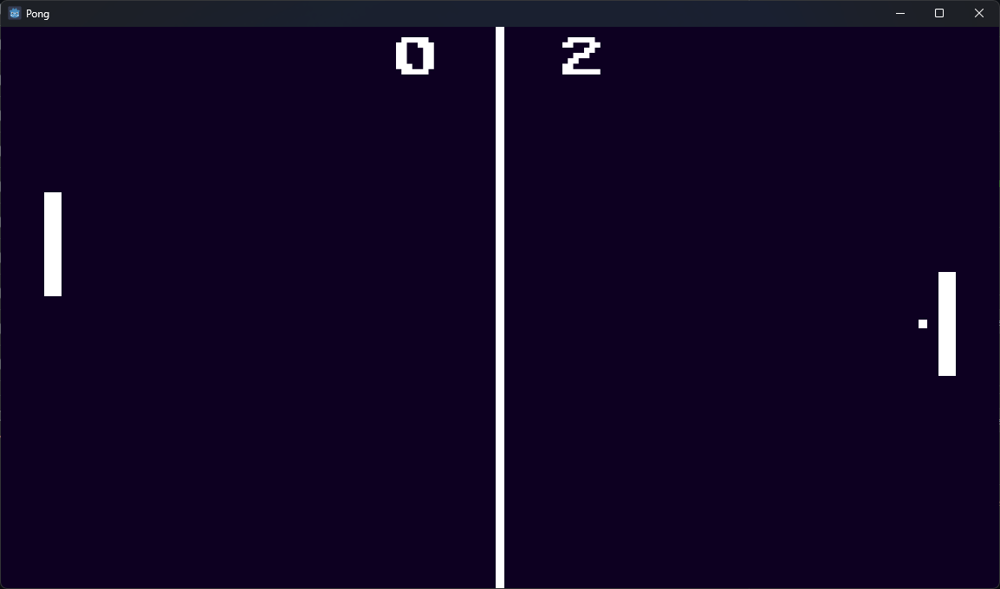

# Pong

Classic pong game built with Godot and C# to learn the basics of Godot and game programming.

This game build by following the [tutorial](https://www.youtube.com/watch?v=Xq9AyhX8HUc) by [russs123](https://github.com/russs123).

On top of the original game in the tutorial
- Added multi-player 
- Added pause/unpause capabilities
- Added sound effects